# Auto Iteration by Python Script
This package mainly submits HTCondor reconstruction jobs and does millepede alignment iteratively.

The `auto_iter.py` script can do iteration automatically if run as a daemon, like:
```bash
nohup python3 auto_iter.py -y 2023 -r 011705 -f 450-500 -i 10 &>>auto_iter.log &
```

The script will find the specified raw files in `/eos/experiment/faser/raw/` and repeat the iteration 10` times as specified by the `-i` operation.

> Suggestion from Chi Wang: `nohup` is an unsatisfactory solution on `lxplus`. An alternative solution is organizing the jobs collectively using HTCondor DAGMan, as is the present solution for FASER prompt-reco and MC production. (See, for example, repository at https://gitlab.cern.ch/faser/offline/mcp)

## FASER Alignment Process

The FASER alignment process uses HTCondor for automated parallel processing with iterative refinement. The following diagram illustrates the complete workflow:

```mermaid
flowchart TD
    Start(["Start: auto_iter.py"]) --> Init["Initialize Parameters<br/>Year, Run, Files, Iterations"]
    Init --> CreateDirs["Create Work Directory<br/>Y_year_R_run_F_files"]
    CreateDirs --> IterLoop{"Iteration Loop<br/>i = 1 to N"}
    
    IterLoop -->|"For each iteration"| IterSetup["Setup Iteration Directory<br/>iter_i: 1reco, 2kfalignment, 3millepede"]
    
    IterSetup --> PrepAlign{"First Iteration?"}
    PrepAlign -->|"Yes"| CreateEmpty["Create Empty<br/>inputforalign.txt"]
    PrepAlign -->|"No"| CopyAlign["Copy inputforalign.txt<br/>from previous iteration"]
    
    CreateEmpty --> PrepCondor["Prepare HTCondor Submit File"]
    CopyAlign --> PrepCondor
    
    PrepCondor --> SubmitJobs["Submit HTCondor Jobs<br/>condor_submit -spool"]
    
    SubmitJobs --> ParallelReco["Parallel Reconstruction Jobs<br/>One per raw file"]
    
    ParallelReco --> RecoJob1["HTCondor Job 1<br/>runAlignment.sh"]
    ParallelReco --> RecoJob2["HTCondor Job 2<br/>runAlignment.sh"]
    ParallelReco --> RecoJobN["HTCondor Job N<br/>runAlignment.sh"]
    
    RecoJob1 --> SetupEnv1["Setup ATLAS Environment"]
    RecoJob2 --> SetupEnv2["Setup ATLAS Environment"]
    RecoJobN --> SetupEnvN["Setup ATLAS Environment"]
    
    SetupEnv1 --> SetupDB1["Setup Alignment Database<br/>aligndb_copy.sh"]
    SetupEnv2 --> SetupDB2["Setup Alignment Database<br/>aligndb_copy.sh"]
    SetupEnvN --> SetupDBN["Setup Alignment Database<br/>aligndb_copy.sh"]
    
    SetupDB1 --> RunReco1["Run Reconstruction<br/>faser_reco_alignment.py"]
    SetupDB2 --> RunReco2["Run Reconstruction<br/>faser_reco_alignment.py"]
    SetupDBN --> RunRecoN["Run Reconstruction<br/>faser_reco_alignment.py"]
    
    RunReco1 --> Output1["Output: kfalignment ROOT files"]
    RunReco2 --> Output2["Output: kfalignment ROOT files"]
    RunRecoN --> OutputN["Output: kfalignment ROOT files"]
    
    Output1 --> Monitor["Monitor HTCondor Jobs<br/>condor_q every 5 minutes"]
    Output2 --> Monitor
    OutputN --> Monitor
    
    Monitor --> CheckStatus{"All Jobs<br/>Complete?"}
    CheckStatus -->|"No: idle or running"| Monitor
    CheckStatus -->|"Hold"| ErrorHandle["Error: Jobs on Hold"]
    CheckStatus -->|"Yes: all done"| CollectResults["Collect kfalignment files<br/>in 2kfalignment directory"]
    
    ErrorHandle --> End(["Error Exit"])
    
    CollectResults --> RunMille["Run Millepede Algorithm<br/>millepede/bin/millepede.py"]
    
    RunMille --> GenConstants["Generate New Alignment Constants<br/>Update inputforalign.txt"]
    
    GenConstants --> CheckIter{"More<br/>Iterations?"}
    CheckIter -->|"Yes"| IterLoop
    CheckIter -->|"No"| Complete(["Complete: Final Alignment Constants"])
    
    style Start fill:#90EE90
    style Complete fill:#90EE90
    style End fill:#FFB6C1
    style ParallelReco fill:#FFE4B5
    style RecoJob1 fill:#FFE4B5
    style RecoJob2 fill:#FFE4B5
    style RecoJobN fill:#FFE4B5
    style RunMille fill:#87CEEB
    style Monitor fill:#DDA0DD
```



### Key Components:

1. **auto_iter.py**: Main orchestration script that manages the iterative alignment process
2. **HTCondor Jobs**: Parallel processing of raw data files using HTCondor job submission and monitoring
3. **runAlignment.sh**: Shell script executed on each HTCondor node for individual raw file processing
4. **faser_reco_alignment.py**: FASER reconstruction algorithm based on ATLAS Athena framework
5. **Millepede**: Alignment algorithm that processes all kfalignment data to generate new alignment constants
6. **Iteration Loop**: The process repeats N times, with each iteration using improved alignment constants

### Data Flow:

- **Input**: Raw data files from `/eos/experiment/faser/raw/{year}/{run}/`
- **Intermediate**: kfalignment ROOT files in `2kfalignment/` directory
- **Output**: Final alignment constants in `inputforalign.txt` after all iterations

## Source environment

### Event Reconstruction Environment Configuration
The script automatically creates the environment setup script if it does not exist. Provide the path to your Calypso installation using the `--calypso_path` argument when running `main.py`.

If the environment script already exists, it will use the existing one. You can specify a custom path with `--env_script` (default: `reco_condor_env.sh`).

The environment script should contain *<u>(if not running Millepede on HTCondor)</u>*:
```bash
#!/bin/bash
export ATLAS_LOCAL_ROOT_BASE=/cvmfs/atlas.cern.ch/repo/ATLASLocalRootBase 
source ${ATLAS_LOCAL_ROOT_BASE}/user/atlasLocalSetup.sh
asetup --input=calypso/asetup.faser Athena,24.0.41
source /path/to/your/calypso/install/setup.sh
```

> :exclamation: Attention: Replace `/path/to/your/calypso/install` with your actual Calypso installation path when using `--calypso_path`.

This script will be used to configure the environment on HTCondor computing nodes.

### Detector Alignment Environment Configuration

The software tool used is `Millepede II`, which consists of two parts: `Mille` and `pede`. In the current version of the script, the `Mille` part is linked in the `millepede` directory and its invocation is integrated in the `faser_alignment.py` script; while the `pede` part needs to be installed and configured separately.

#### Installing `pede`

The source code for `pede` can be obtained from Claus Kleinwort's DESY GitLab Repo. Clone it with the following command:

```bash
git clone --depth 1 --branch V04-17-06 \
     https://gitlab.desy.de/claus.kleinwort/millepede-ii.git /path/to/your/pede/
cd /path/to/your/pede/
make pede
```

It is generally recommended to test after installation (takes about 10s):

```bash
./pede -t
```

> :exclamation: Attention: Replace `/path/to/your/pede/` with the actual `pede` installation path.
>
> :exclamation: Attention: It is strongly suggested that `pede` is installed in the environment specified earlier, so as to ensure consistency in terms of `ROOT` version. Issues from `ROOT` version incompatibility have been reported.

#### Configuring Environment Variables

Apart from the standard `Athena`-`calypso` setup, adding the `pede` path is also required for the execution of alignment.

```bash
export PATH=/your/path/to/pede:$PATH
export LD_LIBRARY_PATH=/your/path/to/pede:$LD_LIBRARY_PATH
```

> :exclamation: If running `Millepede` on HTCondor, make sure that these two lines are added to the "`env_script`".

## Event Reconstruction with `HTCondor`: `main.py`

### Basic usage
```bash
python main.py --year 2023 --run 011705 --file 400 --iteration 1 --calypso_path /path/to/calypso/install
# Or use short options
python main.py -y 2023 -r 11705 -f 400 -i 1 --calypso_path /path/to/calypso/install
```

### Batch processing multiple raw files
```bash
# Use range format start-end
python main.py --year 2023 --run 011705 --file 400-450 --iteration 1 --calypso_path /path/to/calypso/install

# Use range format start:end
python main.py --year 2023 --run 011705 --file 400:450 --iteration 1 --calypso_path /path/to/calypso/install

# Short option form
python main.py -y 2023 -r 11705 -f 400-450 -i 1 --calypso_path /path/to/calypso/install
```

### Parameter description
- `--year, -y`: Year (required, e.g.: 2022-2025)
- `--run, -r`: Run number (required, e.g.: 011705, will be zero-padded to 6 digits)
- `--file, -f`: Single raw file number (e.g.: 400) or range (e.g.: 400-450 or 400:450)
- `--fourst`: Run 4-station mode (optional, off by default)
- `--threest`: Run 3-station mode (optional, on by default)
- `--env_script`: Path to environment setup script. Will be created if it does not exist. (default: reco_condor_env.sh)
- `--calypso_path`: Path to Calypso installation. Required if env_script does not exist.


## Overall Workflow

### Performing Initial Event Reconstruction
- Run the `main.py` main program
  - The class for processing the `--file` parameter is in `RawList.py`
- Generates the `submit_unbiased.sub` file and submits it to Condor with `-spool`
  - Submission information is stored in `main.log`
  - Each Condor node independently runs the `runAlignment.sh` script to process each `.raw` file
  - The script includes `aligndb_copy.sh` parameter configuration and the `faser_reco_alignment.py` reconstruction algorithm
  - After completion, use `condor_transfer_data ${Cluster}` to retrieve log files
- The reconstructed `.root` files are stored in the `../2root_file` directory

### Performing Alignment with Millepede

The process is manifestly integrated inside `millepede/bin/millepede.py` script, and is therefore greatly simplified.

* Ensure that the `pede` path is added to `$PATH` and `$LD_LIBRARY_PATH`.

* Execute the `millepede/bin/millepede.py` script from any directory, specifying the input file path using the `-i` argument:
    ```bash
    python /path/to/cloned/repo/millepede/bin/millepede.py -i /path/to/alignment/workspace
    ```

    The `/path/to/alignment/workspace` should be the path to the `1reco` output path from the previous reco jobs, for example,`/eos/user/c/chiw/FASER/Alignment/Alignment-Shunliang/Y2023_R011705_F400-450/iter01/1reco/`.

`Millepede` typically takes only a few minutes for root files from 50 raw files.

### Iterate with Alignment Constants

Iteration with alignment constants is necessary before we arrive at a satisfactory result. Alignment constants are loaded automatically for the next round of reconstruction by the `main.py`:

```bash
python main.py -y 2023 -r 11705 -f 400 -i 1 --calypso_path /path/to/calypso/install
```

Submission of HTCondor jobs is automatically done here again. Running `Millepede` after acquiring the reco results would be very much the same.

### Alignment Process Diagram


## :construction: Auto-Iteration Using HTCondor DAGman

### Log files
After job execution, log files are saved in the `logs/` directory:
- `job_$(Cluster)_$(Process).out` - Standard output
- `job_$(Cluster)_$(Process).err` - Error output
- `job_$(Cluster)_$(Process).log` - Condor log