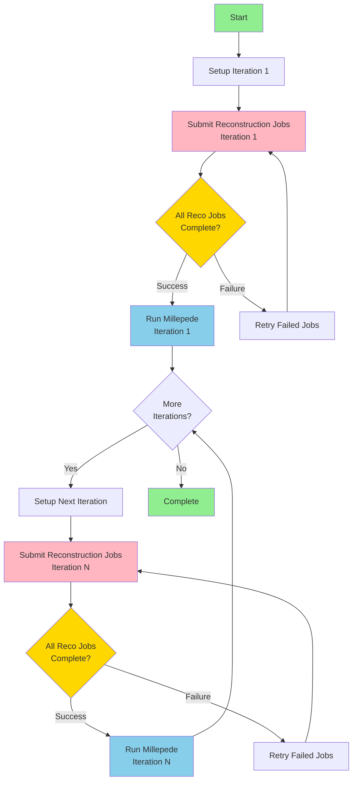

# Auto Iteration by Python Script
This package mainly submits HTCondor reconstruction jobs and does millepede alignment iteratively.

The `auto_iter.py` script can do iteration automatically if run as a daemon, like:
```bash
nohup python3 auto_iter.py -y 2023 -r 011705 -f 450-500 -i 10 &>>auto_iter.log &
```

The script will find the specified raw files in `/eos/experiment/faser/raw/` and repeat the iteration 10` times as specified by the `-i` operation.

> Suggestion from Chi Wang: `nohup` is an unsatisfactory solution on `lxplus`. An alternative solution is organizing the jobs collectively using HTCondor DAGMan, as is the present solution for FASER prompt-reco and MC production. (See, for example, repository at https://gitlab.cern.ch/faser/offline/mcp)


## Source environment

### Event Reconstruction Environment Configuration
The script automatically creates the environment setup script if it does not exist. Provide the path to your Calypso installation using the `--calypso_path` argument when running `main.py`.

If the environment script already exists, it will use the existing one. You can specify a custom path with `--env_script` (default: `reco_condor_env.sh`).

The environment script should contain *<u>(if not running Millepede on HTCondor)</u>*:
```bash
#!/bin/bash
export ATLAS_LOCAL_ROOT_BASE=/cvmfs/atlas.cern.ch/repo/ATLASLocalRootBase 
source ${ATLAS_LOCAL_ROOT_BASE}/user/atlasLocalSetup.sh
asetup --input=calypso/asetup.faser Athena,24.0.41
source /path/to/your/calypso/install/setup.sh
```

> :exclamation: Attention: Replace `/path/to/your/calypso/install` with your actual Calypso installation path when using `--calypso_path`.

This script will be used to configure the environment on HTCondor computing nodes.

### Detector Alignment Environment Configuration

The software tool used is `Millepede II`, which consists of two parts: `Mille` and `pede`. In the current version of the script, the `Mille` part is linked in the `millepede` directory and its invocation is integrated in the `faser_alignment.py` script; while the `pede` part needs to be installed and configured separately.

#### Installing `pede`

The source code for `pede` can be obtained from Claus Kleinwort's DESY GitLab Repo. Clone it with the following command:

```bash
git clone --depth 1 --branch V04-17-06 \
     https://gitlab.desy.de/claus.kleinwort/millepede-ii.git /path/to/your/pede/
cd /path/to/your/pede/
make pede
```

It is generally recommended to test after installation (takes about 10s):

```bash
./pede -t
```

> :exclamation: Attention: Replace `/path/to/your/pede/` with the actual `pede` installation path.
>
> :exclamation: Attention: It is strongly suggested that `pede` is installed in the environment specified earlier, so as to ensure consistency in terms of `ROOT` version. Issues from `ROOT` version incompatibility have been reported.

#### Configuring Environment Variables

Apart from the standard `Athena`-`calypso` setup, adding the `pede` path is also required for the execution of alignment.

```bash
export PATH=/your/path/to/pede:$PATH
export LD_LIBRARY_PATH=/your/path/to/pede:$LD_LIBRARY_PATH
```

> :exclamation: If running `Millepede` on HTCondor, make sure that these two lines are added to the "`env_script`".

## Event Reconstruction with `HTCondor`: `main.py`

### Basic usage
```bash
python main.py --year 2023 --run 011705 --file 400 --iteration 1 --calypso_path /path/to/calypso/install
# Or use short options
python main.py -y 2023 -r 11705 -f 400 -i 1 --calypso_path /path/to/calypso/install
```

### Batch processing multiple raw files
```bash
# Use range format start-end
python main.py --year 2023 --run 011705 --file 400-450 --iteration 1 --calypso_path /path/to/calypso/install

# Use range format start:end
python main.py --year 2023 --run 011705 --file 400:450 --iteration 1 --calypso_path /path/to/calypso/install

# Short option form
python main.py -y 2023 -r 11705 -f 400-450 -i 1 --calypso_path /path/to/calypso/install
```

### Parameter description
- `--year, -y`: Year (required, e.g.: 2022-2025)
- `--run, -r`: Run number (required, e.g.: 011705, will be zero-padded to 6 digits)
- `--file, -f`: Single raw file number (e.g.: 400) or range (e.g.: 400-450 or 400:450)
- `--fourst`: Run 4-station mode (optional, off by default)
- `--threest`: Run 3-station mode (optional, on by default)
- `--env_script`: Path to environment setup script. Will be created if it does not exist. (default: reco_condor_env.sh)
- `--calypso_path`: Path to Calypso installation. Required if env_script does not exist.


## Overall Workflow

### Performing Initial Event Reconstruction
- Run the `main.py` main program
  - The class for processing the `--file` parameter is in `RawList.py`
- Generates the `submit_unbiased.sub` file and submits it to Condor with `-spool`
  - Submission information is stored in `main.log`
  - Each Condor node independently runs the `runAlignment.sh` script to process each `.raw` file
  - The script includes `aligndb_copy.sh` parameter configuration and the `faser_reco_alignment.py` reconstruction algorithm
  - After completion, use `condor_transfer_data ${Cluster}` to retrieve log files
- The reconstructed `.root` files are stored in the `../2root_file` directory

### Performing Alignment with Millepede

The process is manifestly integrated inside `millepede/bin/millepede.py` script, and is therefore greatly simplified.

* Ensure that the `pede` path is added to `$PATH` and `$LD_LIBRARY_PATH`.

* Execute the `millepede/bin/millepede.py` script from any directory, specifying the input file path using the `-i` argument:
    ```bash
    python /path/to/cloned/repo/millepede/bin/millepede.py -i /path/to/alignment/workspace
    ```

    The `/path/to/alignment/workspace` should be the path to the `1reco` output path from the previous reco jobs, for example,`/eos/user/c/chiw/FASER/Alignment/Alignment-Shunliang/Y2023_R011705_F400-450/iter01/1reco/`.

`Millepede` typically takes only a few minutes for root files from 50 raw files.

### Iterate with Alignment Constants

Iteration with alignment constants is necessary before we arrive at a satisfactory result. Alignment constants are loaded automatically for the next round of reconstruction by the `main.py`:

```bash
python main.py -y 2023 -r 11705 -f 400 -i 1 --calypso_path /path/to/calypso/install
```

Submission of HTCondor jobs is automatically done here again. Running `Millepede` after acquiring the reco results would be very much the same.

### Alignment Process Diagram


## Auto-Iteration Using HTCondor DAGman

### Overview

HTCondor DAGman (Directed Acyclic Graph Manager) provides a robust solution for managing iterative alignment workflows on CERN's lxplus infrastructure. Unlike daemon-based approaches, DAGman is officially supported and provides:

- **Automatic job dependency management**: Ensures reconstruction completes before alignment
- **Built-in retry logic**: Handles transient failures automatically
- **Progress tracking**: Monitor workflow status with standard HTCondor tools
- **No daemon required**: Eliminates need for persistent background processes
- **Better resource management**: Integrates with HTCondor's scheduling system

### Workflow Architecture

The DAGman-based workflow follows this process:



**Key Components:**

1. **DAG File**: Defines job dependencies and workflow structure
2. **Reconstruction Jobs**: Process raw data files in parallel (HTCondor jobs)
3. **Millepede Jobs**: Perform alignment calculation after reconstruction
4. **Iteration Chaining**: Each iteration depends on previous iteration's completion
5. **Automatic Retry**: Failed jobs are retried according to configured policy

### Configuration Management

Path configuration is now centralized in `config.json`:

```json
{
  "paths": {
    "calypso_install": "/path/to/calypso/install",
    "pede_install": "/path/to/pede",
    "env_script": "reco_condor_env.sh"
  },
  "htcondor": {
    "job_flavour": "longlunch",
    "request_cpus": 1,
    "max_retries": 3,
    "requirements": "(Machine =!= LastRemoteHost) && (OpSysAndVer =?= \"AlmaLinux9\")"
  },
  "alignment": {
    "default_iterations": 10,
    "polling_interval_seconds": 300
  }
}
```

**Setup:**
1. Create configuration file:
   ```bash
   python config.py
   ```

2. Edit `config.json` to set your installation paths

3. Validate configuration:
   ```bash
   python -c "from config import AlignmentConfig; c = AlignmentConfig(); c.validate_paths()"
   ```

### Basic Usage

**Generate and submit a DAG workflow:**

```bash
# Generate DAG for 10 iterations
python dag_manager.py --year 2023 --run 011705 --files 400-450 --iterations 10

# Generate and auto-submit
python dag_manager.py -y 2023 -r 011705 -f 400-450 -i 10 --submit
```

**Monitor DAG progress:**

```bash
# Check DAG status
condor_q

# View DAG node status
condor_q -dag

# Check specific DAG
condor_q -nobatch

# View DAGman log
tail -f Y2023_R011705_F400-450/alignment.dag.dagman.out
```

**DAG Management:**

```bash
# Remove DAG from queue
condor_rm <DAGman_job_id>

# Rescue a failed DAG (retry from last successful point)
condor_submit_dag Y2023_R011705_F400-450/alignment.dag.rescue001
```

### Generated Directory Structure

```
Y2023_R011705_F400-450/
├── alignment.dag              # Main DAG file
├── alignment.dag.dagman.out   # DAGman execution log
├── alignment.dag.lib.out      # DAGman library log
├── alignment.dag.lib.err      # DAGman library errors
├── iter01/
│   ├── 1reco/
│   │   ├── reco.sub          # Reconstruction submit file
│   │   ├── inputforalign.txt # Alignment constants (empty for iter 1)
│   │   ├── logs/             # Job logs
│   │   └── <run>/<file>/     # Per-file work directories
│   ├── 2kfalignment/         # KF alignment output files
│   └── 3millepede/
│       ├── millepede.sub     # Millepede submit file
│       ├── run_millepede.sh  # Millepede wrapper script
│       └── millepede.out     # Millepede output
├── iter02/
│   └── ...                   # Same structure for each iteration
└── ...
```

### Advantages over Daemon Approach

| Feature | Daemon (`auto_iter.py`) | DAGman (`dag_manager.py`) |
|---------|------------------------|---------------------------|
| **Supported on lxplus** | ❌ Not officially supported | ✅ Officially supported |
| **Job Dependency** | Manual polling | Automatic by HTCondor |
| **Failure Handling** | Script-based | Built-in retry logic |
| **Monitoring** | Custom logs | Standard HTCondor tools |
| **Resource Usage** | Persistent process | No persistent process |
| **Scalability** | Limited | Excellent |
| **Recovery** | Manual intervention | Automatic rescue DAGs |

### Migration from Daemon

**Old approach (daemon-based):**
```bash
nohup python3 auto_iter.py -y 2023 -r 011705 -f 450-500 -i 10 &>>auto_iter.log &
```

**New approach (DAGman-based):**
```bash
python dag_manager.py -y 2023 -r 011705 -f 450-500 -i 10 --submit
```

The DAGman approach provides the same functionality with better reliability and is the recommended method for production workflows.

### Log files
After job execution, log files are saved in the `logs/` directory:
- `reco_$(Process).out` - Reconstruction standard output
- `reco_$(Process).err` - Reconstruction error output
- `reco_$(Process).log` - Reconstruction HTCondor log
- `millepede.out` - Millepede standard output
- `millepede.err` - Millepede error output
- `millepede.log` - Millepede HTCondor log