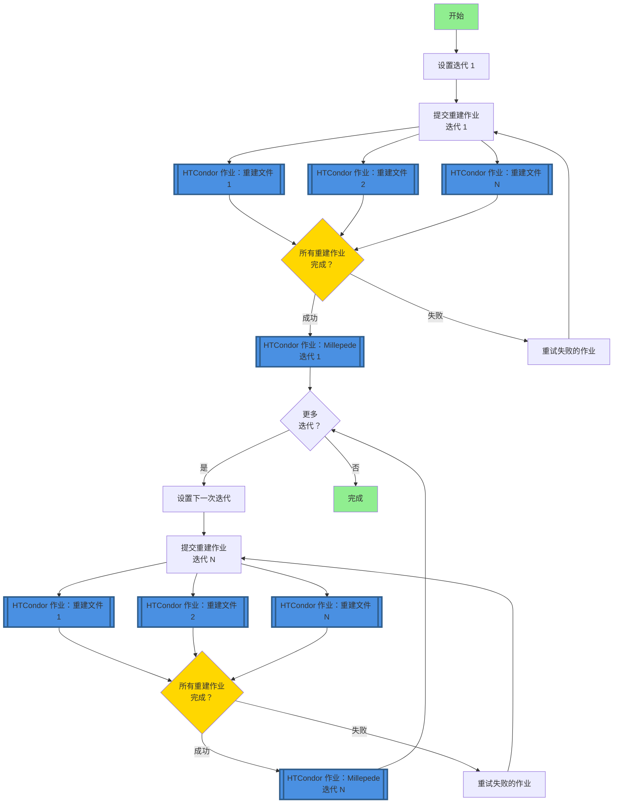

# 使用 HTCondor 进行 FASER 对齐校准

本软件包为 FASER 实验提交 HTCondor 重建作业并迭代执行 Millepede 对齐校准。

## 🚀 快速开始（推荐：HTCondor DAGman）

**推荐方法**使用 HTCondor DAGman 在 lxplus 上进行可靠的、官方支持的工作流管理：

```bash
# 1. 配置设置
bash setup_config.sh

# 2. 生成并提交 DAG 工作流
python3 dag_manager.py -y 2023 -r 011705 -f 400-450 -i 10 --submit

# 3. 监控进度
condor_q -dag
```

📖 **详细说明和示例请参见 [USAGE_GUIDE.md](USAGE_GUIDE.md)。**

## 传统守护进程方法（不推荐）

`auto_iter.py` 脚本可以作为守护进程自动进行迭代：
```bash
nohup python3 auto_iter.py -y 2023 -r 011705 -f 450-500 -i 10 &>>auto_iter.log &
```

⚠️ **注意**：此守护进程方法在 lxplus 上不受官方支持。强烈建议在生产环境中使用上述 HTCondor DAGman 方案。


## 源环境

### 事例重建环境配置
脚本会在环境脚本不存在时自动创建。运行 `main.py` 时使用 `--calypso_path` 参数提供 Calypso 安装路径即可。

如果环境脚本已存在，将直接使用现有脚本。可通过 `--env_script` 参数指定自定义路径（默认: `reco_condor_env.sh`）。

环境脚本所需包含内容如下 *<u>（如果不在 HTCondor 上运行 Millepede）</u>*：
```bash
#!/bin/bash
export ATLAS_LOCAL_ROOT_BASE=/cvmfs/atlas.cern.ch/repo/ATLASLocalRootBase 
source ${ATLAS_LOCAL_ROOT_BASE}/user/atlasLocalSetup.sh
asetup --input=calypso/asetup.faser Athena,24.0.41
source /path/to/your/calypso/install/setup.sh
```

> :exclamation: 注意：使用 `--calypso_path` 参数时，请将 `/path/to/your/calypso/install` 替换为实际的 Calypso 安装路径。

以上脚本将会被用于在 HTCondor 计算节点中配置环境。

### 探测器对齐校准（Alignment）环境配置

所使用的软件工具为 `Millepede II`，这一软件包由 `Mille` 和 `pede` 两个部分组成。在当前版本脚本中，`Mille` 部分被链接在 `millepede` 目录下，且其调用已集成在 `faser_alignment.py` 脚本中；而 `pede` 部分则需要单独安装和配置。

#### 安装 `pede`

`pede` 的源代码可以通过 Claus Kleinwort 的 DESY GitLab Repo 获得，通过以下命令克隆：

```bash
git clone --depth 1 --branch V04-17-06 \
     https://gitlab.desy.de/claus.kleinwort/millepede-ii.git /path/to/your/pede/
cd /path/to/your/pede/
make pede
```

一般建议在安装后进行测试（大约10秒）：

```bash
./pede -t
```

> :exclamation: 注意：请将 `/path/to/your/pede/` 替换为实际的 `pede` 安装路径。
>
> :exclamation: 注意：强烈建议在之前指定的环境中安装 `pede`，以确保 `ROOT` 版本一致。已有报告称 `ROOT` 版本不兼容导致问题。

#### 配置环境变量

除标准 `Athena`-`calypso` 设置外，还需要添加 `pede` 路径才能执行对齐：

```bash
export PATH=/your/path/to/pede:$PATH
export LD_LIBRARY_PATH=/your/path/to/pede:$LD_LIBRARY_PATH
```

> :exclamation: 如果在 HTCondor 上运行 `Millepede`，请确保将这两行添加到 "`env_script`"。

## 借助 `HTCondor` 进行事例重建：`main.py`

### 基本用法
```bash
python main.py --year 2023 --run 011705 --file 400 --iteration 1 --calypso_path /path/to/calypso/install
# 或使用简短参数
python main.py -y 2023 -r 11705 -f 400 -i 1 --calypso_path /path/to/calypso/install
```

### 批量处理多个原始文件
```bash
# 使用范围格式 start-end
python main.py --year 2023 --run 011705 --file 400-450 --iteration 1 --calypso_path /path/to/calypso/install

# 使用范围格式 start:end
python main.py --year 2023 --run 011705 --file 400:450 --iteration 1 --calypso_path /path/to/calypso/install

# 简短参数形式
python main.py -y 2023 -r 11705 -f 400-450 -i 1 --calypso_path /path/to/calypso/install
```

### 参数说明
- `--year, -y`: 年份（必需，例如: 2022-2025）
- `--run, -r`: 运行编号（必需，例如: 011705，会自动补零到6位）
- `--file, -f`: 单个原始文件编号（如: 400）或范围（如: 400-450 或 400:450）
- `--fourst`: 运行4站模式（可选，默认关闭）
- `--threest`: 运行3站模式（可选，默认开启）
- `--env_script`: 环境配置脚本路径。如不存在将自动创建。（默认: reco_condor_env.sh）
- `--calypso_path`: Calypso 安装路径。当 env_script 不存在时必需。


## 整体工作流

### 执行初始事例重建
- 运行 `main.py` 主程序
  - 处理 `--file` 参数的类位于 `RawList.py` 中
- 生成 `submit_unbiased.sub` 文件，并以 `-spool` 形式提交到 Condor
  - 提交信息存储在 `main.log` 中
  - 每一个 Condor 节点独立运行 `runAlignment.sh` 脚本处理各个 `.raw` 文件
  - 脚本中包括 `aligndb_copy.sh` 参数配置和 `faser_reco_alignment.py` 重建算法
  - 完成后使用 `condor_transfer_data ${Cluster}` 获取日志文件
- 重建的 `.root` 文件存储在 `../2root_file` 目录中

### 使用 Millepede 执行对齐

该过程明显集成在 `millepede/bin/millepede.py` 脚本中，因此大大简化。

* 确保将 `pede` 路径添加到 `$PATH` 和 `$LD_LIBRARY_PATH`。

* 从任意目录执行 `millepede/bin/millepede.py` 脚本，使用 `-i` 参数指定输入文件路径：
    ```bash
    python /path/to/cloned/repo/millepede/bin/millepede.py -i /path/to/alignment/workspace
    ```

    `/path/to/alignment/workspace` 应该是前一个重建作业的 `1reco` 输出路径，例如 `/eos/user/c/chiw/FASER/Alignment/Alignment-Shunliang/Y2023_R011705_F400-450/iter01/1reco/`。

对于来自50个原始文件的根文件，`Millepede` 通常只需要几分钟。

### 使用对齐常数迭代

在得到满意的结果之前，需要使用对齐常数进行迭代。下一轮重建会由 `main.py` 自动加载对齐常数：

```bash
python main.py -y 2023 -r 11705 -f 400 -i 1 --calypso_path /path/to/calypso/install
```

这里会再次自动提交 HTCondor 作业。获得重建结果后运行 `Millepede` 的方式非常相似。

### 对齐流程图


## 使用 HTCondor DAGman 进行自动迭代

### 概述

HTCondor DAGman（有向无环图管理器）为 CERN lxplus 基础设施上的迭代对齐工作流管理提供了可靠的解决方案。与基于守护进程的方法不同，DAGman 受官方支持并提供：

- **自动作业依赖管理**：确保重建在对齐之前完成
- **内置重试逻辑**：自动处理瞬时故障
- **进度跟踪**：使用标准 HTCondor 工具监控工作流状态
- **无需守护进程**：消除持久后台进程的需求
- **更好的资源管理**：与 HTCondor 的调度系统集成

### 工作流架构

基于 DAGman 的工作流遵循以下流程：



**关键组件：**

1. **DAG 文件**：定义作业依赖关系和工作流结构
2. **重建作业**（蓝色框）：多个并行 HTCondor 作业，每个原始数据文件一个作业
3. **Millepede 作业**（蓝色框）：每次迭代一个 HTCondor 作业用于对齐计算
4. **迭代链接**：每次迭代取决于上一次迭代的完成
5. **自动重试**：根据配置的策略重试失败的作业

**注意**：HTCondor 作业以蓝色突出显示。每个重建阶段提交多个作业（每个文件一个），而每个对齐阶段提交单个 Millepede 作业。

### 配置管理

路径配置现已集中在 `config.json` 中：

```json
{
  "paths": {
    "calypso_install": "/path/to/calypso/install",
    "pede_install": "/path/to/pede",
    "env_script": "reco_condor_env.sh"
  },
  "htcondor": {
    "job_flavour": "longlunch",
    "request_cpus": 1,
    "max_retries": 3,
    "requirements": "(Machine =!= LastRemoteHost) && (OpSysAndVer =?= \"AlmaLinux9\")"
  },
  "alignment": {
    "default_iterations": 10,
    "polling_interval_seconds": 300
  }
}
```

**设置：**
1. 创建配置文件：
   ```bash
   python config.py
   ```

2. 编辑 `config.json` 设置您的安装路径

3. 验证配置：
   ```bash
   python -c "from config import AlignmentConfig; c = AlignmentConfig(); c.validate_paths()"
   ```

### 基本用法

**生成并提交 DAG 工作流：**

```bash
# 生成10次迭代的 DAG
python dag_manager.py --year 2023 --run 011705 --files 400-450 --iterations 10

# 生成并自动提交
python dag_manager.py -y 2023 -r 011705 -f 400-450 -i 10 --submit
```

**监控 DAG 进度：**

```bash
# 检查 DAG 状态
condor_q

# 查看 DAG 节点状态
condor_q -dag

# 检查特定 DAG
condor_q -nobatch

# 查看 DAGman 日志
tail -f Y2023_R011705_F400-450/alignment.dag.dagman.out
```

**DAG 管理：**

```bash
# 从队列中删除 DAG
condor_rm <DAGman_job_id>

# 挽救失败的 DAG（从最后成功点重试）
condor_submit_dag Y2023_R011705_F400-450/alignment.dag.rescue001
```

### 生成的目录结构

```
Y2023_R011705_F400-450/
├── alignment.dag              # 主 DAG 文件
├── alignment.dag.dagman.out   # DAGman 执行日志
├── alignment.dag.lib.out      # DAGman 库日志
├── alignment.dag.lib.err      # DAGman 库错误
├── iter01/
│   ├── 1reco/
│   │   ├── reco.sub          # 重建提交文件
│   │   ├── inputforalign.txt # 对齐常数（迭代1为空）
│   │   ├── logs/             # 作业日志
│   │   └── <run>/<file>/     # 每个文件的工作目录
│   ├── 2kfalignment/         # KF 对齐输出文件
│   └── 3millepede/
│       ├── millepede.sub     # Millepede 提交文件
│       ├── run_millepede.sh  # Millepede 包装脚本
│       └── millepede.out     # Millepede 输出
├── iter02/
│   └── ...                   # 每次迭代的相同结构
└── ...
```

### 相比守护进程方法的优势

| 特性 | 守护进程（`auto_iter.py`） | DAGman（`dag_manager.py`） |
|---------|------------------------|---------------------------|
| **lxplus 支持** | ❌ 非官方支持 | ✅ 官方支持 |
| **作业依赖** | 手动轮询 | 自动由 HTCondor 管理 |
| **故障处理** | 基于脚本 | 内置重试逻辑 |
| **监控** | 自定义日志 | 标准 HTCondor 工具 |
| **资源使用** | 持久进程 | 无持久进程 |
| **可扩展性** | 有限 | 优秀 |
| **恢复** | 手动干预 | 自动挽救 DAG |

### 从守护进程迁移

**旧方法（基于守护进程）：**
```bash
nohup python3 auto_iter.py -y 2023 -r 011705 -f 450-500 -i 10 &>>auto_iter.log &
```

**新方法（基于 DAGman）：**
```bash
python dag_manager.py -y 2023 -r 011705 -f 450-500 -i 10 --submit
```

DAGman 方法提供相同的功能，但可靠性更高，是生产工作流的推荐方法。

### 日志文件
作业执行后，日志文件保存在 `logs/` 目录中：
- `reco_$(Process).out` - 重建标准输出
- `reco_$(Process).err` - 重建错误输出
- `reco_$(Process).log` - 重建 HTCondor 日志
- `millepede.out` - Millepede 标准输出
- `millepede.err` - Millepede 错误输出
- `millepede.log` - Millepede HTCondor 日志