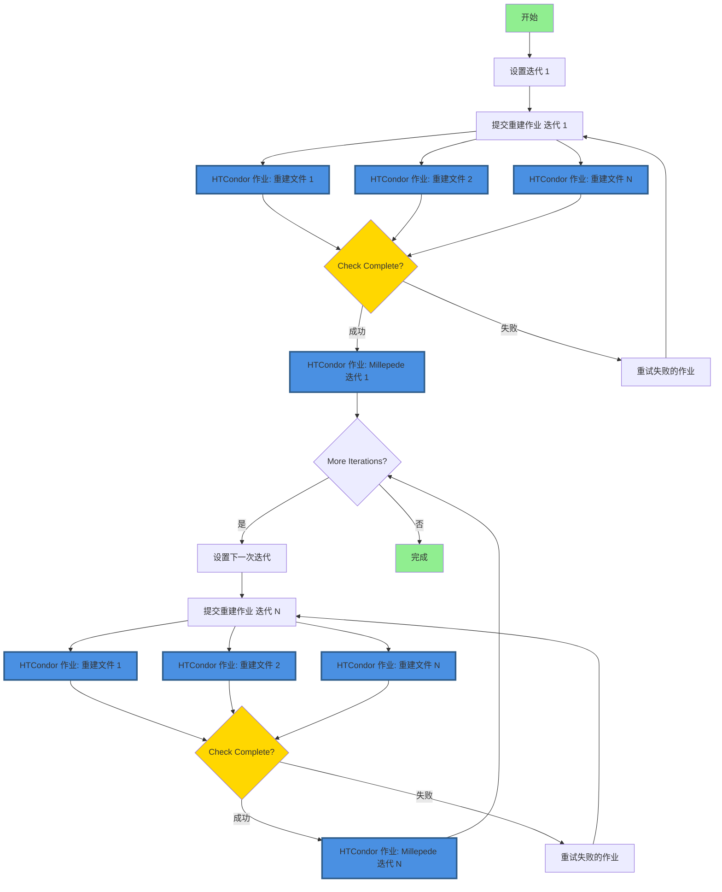

# 使用 HTCondor 进行 FASER 对齐

## 🚀 快速开始（推荐：HTCondor DAGman）

**推荐方法**使用 HTCondor DAGman 在 lxplus 上进行可靠的、官方支持的工作流管理：

```bash
# 1. 配置设置
bash setup_config.sh

# 2. 生成并提交 DAG 工作流
python3 dag_manager.py -y 2023 -r 011705 -f 400-450 -i 10 --submit

# 3. 监控进度
condor_q -dag
```

📖 **详细说明请参见 [USAGE_GUIDE_cn.md](USAGE_GUIDE_cn.md)。**

📁 **AFS/EOS 存储配置和性能优化请参见 [STORAGE_GUIDE_cn.md](STORAGE_GUIDE_cn.md)。**

## 重要：存储配置

为了在 lxplus 上获得最佳性能：
- **从 AFS 提交作业**（小配额，适合作业管理）
- **将大输出存储在 EOS**（大配额，用于 root 文件）
- **将可执行文件保存在 AFS**（访问更快，性能更好）

在 `config.json` 中配置：
```json
{
  "paths": {
    "work_dir": "/afs/cern.ch/user/y/yourusername/alignment-work",
    "eos_output_dir": "/eos/user/y/yourusername/faser-alignment-output"
  },
  "storage": {
    "use_eos_for_output": true
  }
}
```

完整存储设置和最佳实践请参见 [STORAGE_GUIDE_cn.md](STORAGE_GUIDE_cn.md)。

## Source environment

### 事例重建环境配置
脚本会在环境脚本不存在时自动创建。运行 `main.py` 时使用 `--calypso_path` 参数提供 Calypso 安装路径即可。

如果环境脚本已存在，将直接使用现有脚本。可通过 `--env_script` 参数指定自定义路径（默认: `reco_condor_env.sh`）。

环境脚本所需包含内容如下：
```bash
#!/bin/bash
export ATLAS_LOCAL_ROOT_BASE=/cvmfs/atlas.cern.ch/repo/ATLASLocalRootBase 
source ${ATLAS_LOCAL_ROOT_BASE}/user/atlasLocalSetup.sh
asetup --input=calypso/asetup.faser Athena,24.0.41
source /path/to/your/calypso/install/setup.sh
```

> :exclamation: 注意：使用 `--calypso_path` 参数时，请将 `/path/to/your/calypso/install` 替换为实际的 Calypso 安装路径。
>
以上脚本将会被用于在 HTCondor 计算节点中配置环境。

### 探测器对齐校准（Alignment）环境配置

所使用的软件工具为`Millepede II`，这一软件包由`Mille`和`pede`两个部分组成。在当前版本脚本中，`Mille`部分被链接在`millepede`目录下，且其调用已集成在`faser_alignment.py`脚本中；而`pede`部分则需要单独安装和配置。

#### 安装`pede`

`pede`的源代码可以通过Claus Kleinwort的DESY GitLab Repo获得，通过以下命令克隆：

```bash
git clone --depth 1 --branch V04-17-06 \
     https://gitlab.desy.de/claus.kleinwort/millepede-ii.git /path/to/your/pede/
cd /path/to/your/pede/
make pede
```

一般建议在安装后进行测试（大约10s）：

```bash
./pede -t
```

> :exclamation: 注意：请将`/path/to/your/pede/`替换为实际的`pede`安装路径。

#### 配置环境变量

在前面配置


## 借助`HTCondor`进行事例重建：`main.py`

### 基本用法
```bash
git clone git@github.com:shunliang233/raw2reco.git
```

```bash
python main.py --year 2023 --run 011705 --file 400 --calypso_path /path/to/calypso/install
# 或使用简短参数
python main.py -y 2023 -r 11705 -f 400 --calypso_path /path/to/calypso/install
```

### 批量处理多个 rawfile
```bash
# 使用范围格式 start-end
python main.py --year 2023 --run 011705 --file 400-450 --calypso_path /path/to/calypso/install

# 使用范围格式 start:end
python main.py --year 2023 --run 011705 --file 400:450 --calypso_path /path/to/calypso/install

# 简短参数形式
python main.py -y 2023 -r 11705 -f 400-450 --calypso_path /path/to/calypso/install
```

### 参数说明
- `--year, -y`: 年份 (必需，例如: 2022-2025)
- `--run, -r`: 运行编号 (必需，例如: 011705，会自动补零到6位)
- `--file, -f`: 单个原始文件编号 (如: 400) 或范围 (如: 400-450 或 400:450)
- `--fourst`: 运行4站模式 (可选，默认关闭)
- `--threest`: 运行3站模式 (可选，默认开启)
- `--env_script`: 环境配置脚本路径。如不存在将自动创建。（默认: reco_condor_env.sh）
- `--calypso_path`: Calypso 安装路径。当 env_script 不存在时必需。


## 整体工作流

### 执行初始事例重建
- 运行 `main.py` 项目主程序
  - 处理 `--file` 参数的类位于 `RawList.py` 中
- 生成 `submit_unbiased.sub` 文件，并以 `-spool` 形式提交到 Condor
  - 提交信息存储在 `main.log` 中
  - 每一个 Condor 节点中，单独运行 `runAlignment.sh` 脚本处理每个 `.raw` 文件
  - 脚本中包括 `aligndb_copy.sh` 参数配置，和 `faser_reco_alignment.py` 重建算法
  - 运行完成后用 `condor_transfer_data ${Cluster}` 获取日志文件
- 重建的 `.root` 文件存入 `../2root_file` 目录中

### 进行对齐校准（Alignment）

该过程明显集成在 `millepede/bin/millepede.py` 脚本中，因此大大简化。

## 使用 HTCondor DAGman 进行自动迭代

### 概述

HTCondor DAGman（有向无环图管理器）为 CERN lxplus 基础设施上的迭代对齐工作流管理提供了可靠的解决方案。与基于守护进程的方法不同，DAGman 受官方支持并提供：

- **自动作业依赖管理**：确保重建在对齐之前完成
- **内置重试逻辑**：自动处理瞬时故障
- **进度跟踪**：使用标准 HTCondor 工具监控工作流状态
- **无需守护进程**：消除持久后台进程的需求
- **更好的资源管理**：与 HTCondor 的调度系统集成

### 工作流架构

基于 DAGman 的工作流遵循以下流程：



**关键组件：**

1. **DAG 文件**：定义作业依赖关系和工作流结构
2. **重建作业**（蓝色节点）：多个并行 HTCondor 作业，每个原始数据文件一个作业
3. **Millepede 作业**（蓝色节点）：每次迭代一个 HTCondor 作业用于对齐计算
4. **迭代链接**：每次迭代取决于上一次迭代的完成
5. **自动重试**：根据配置的策略重试失败的作业

**注意**：HTCondor 作业以蓝色和粗边框突出显示。每个重建阶段提交多个作业（每个文件一个），而每个对齐阶段提交单个 Millepede 作业。

#### 详细子流程图

**重建作业流程（每个文件）：**


**Millepede 作业流程（每次迭代）：**


### 日志文件
作业执行后，日志文件会保存在 `logs/` 目录：
- `job_$(Cluster)_$(Process).out` - 标准输出
- `job_$(Cluster)_$(Process).err` - 错误输出  
- `job_$(Cluster)_$(Process).log` - Condor日志